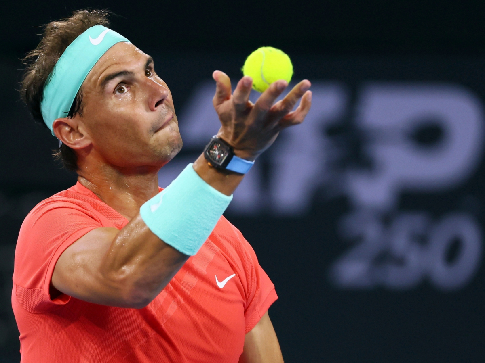
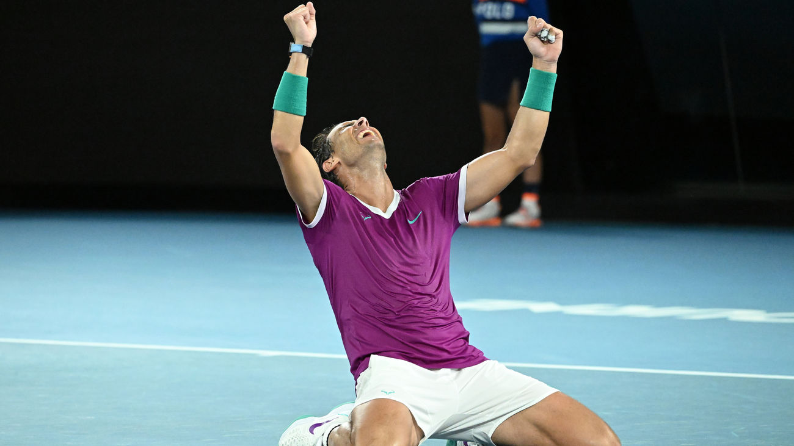

# 🎾🔥 Rafael Nadal  
## Profesional de Tenis  

---

# 📋 Descripción  
- Nació en Mallorca, España (1986).  
- Considerado uno de los mejores tenistas de la historia.  
- Apodado “Rey de la Tierra Batida”.  
- Juego agresivo, gran resistencia y mentalidad combativa.  

---

# 🏆 Logros Destacados  

| Año  | Logro                         | Detalles                  |
|------|-------------------------------|---------------------------|
| 2005 | Primer Grand Slam             | Roland Garros             |
| 2008 | Medalla Olímpica              | Oro en Beijing            |
| 2008 | Wimbledon                    | Primer título en césped   |
| 2019 | Récord en Roland Garros      | 12 títulos                |
| 2020 | 20 títulos Grand Slam         | Igualando récords         |

---

# 🏅 Finales de Grand Slam Ganadas  

| Torneo          | Títulos  | Años destacados                   |
|-----------------|----------|----------------------------------|
| Roland Garros   | 14       | 2005-2022                       |
| US Open         | 4        | 2010-2019                       |
| Wimbledon       | 2        | 2008, 2010                      |
| Australian Open | 2        | 2009, 2022                      |

---

# 🎯 Récords Específicos  
- 81 partidos ganados seguidos en tierra batida.  
- Más títulos en un solo Grand Slam (Roland Garros).  
- Más partidos ganados en tierra batida.  

---

# 🤩 Curiosidades  
- Zurdo que juega con la derecha.  
- Fundador de una academia en Mallorca.  
- Gran fan del Real Madrid.  
- Apodado “El Toro de Manacor”.  

---

# 💬 Citas Famosas  
> “La gente me pregunta si me canso de ganar. Nunca me canso de luchar.”  
> — Rafael Nadal

---

# 🎾 Estilo de Juego  
- Juego agresivo desde fondo de pista.  
- Gran resistencia y fuerza física.  
- Dominante en tierra batida gracias al efecto liftado.  
- Mentalidad de lucha y superación.  

---

# 🕰️ Cronología de la Carrera  
- 2001: Debut profesional.  
- 2005: Primer Roland Garros.  
- 2008: Wimbledon y oro olímpico.  
- 2010: Career Grand Slam completado.  
- 2017: Regreso al número 1.  
- 2022: 22º Grand Slam ganado.  

---

# 🏆 Palmarés Completo (Resumen)  

| Categoría         | Títulos  |
|-------------------|----------|
| Grand Slams       | 22       |
| ATP Masters 1000  | 36       |
| ATP 500           | 23       |
| ATP 250           | 11       |
| Medallas Olímpicas| 2        |
| Copa Davis        | 5        |

---

# 📸 Imágenes  

  

  

---

# ▶️ Video destacado  

  

*Mejores momentos y puntos destacados de Rafael Nadal* 🎥  

---

# ¡Gracias! 🎾🔥  
